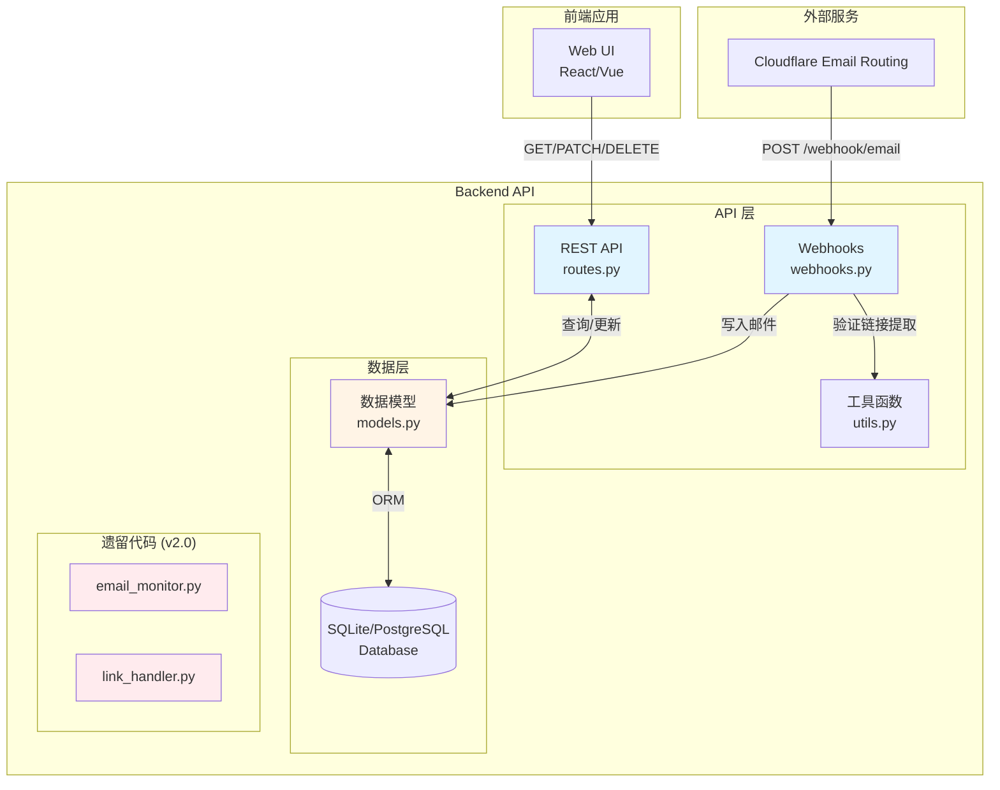

# 系统架构总览

## 1. 系统架构图



## 2. 技术栈

### 核心框架
- **Flask 3.1+**: 轻量级 Web 框架
- **SQLAlchemy 2.0+**: ORM 框架（支持 SQLite/PostgreSQL）
- **Flask-CORS**: 跨域资源共享支持
- **Alembic**: 数据库迁移工具

### 数据库
- **开发环境**: SQLite
- **生产环境**: PostgreSQL（推荐）

### 依赖管理
- **uv**: 快速依赖安装工具
- **虚拟环境**: venv (必须)

## 3. 目录结构详解

```
backend/
├── emailhandler/          # 数据层模块
│   ├── __init__.py       # 模块初始化
│   ├── models.py         # SQLAlchemy 数据模型
│   │   ├── Mailbox       # 邮箱账户表
│   │   ├── Email         # 邮件表
│   │   └── Attachment    # 附件表
│   ├── email_monitor.py  # [遗留] v2.0 邮件监控
│   └── link_handler.py   # [遗留] v2.0 链接处理
│
└── api/                   # API 层模块
    ├── __init__.py       # 蓝图导出
    ├── routes.py         # RESTful API 路由
    │   ├── GET  /api/mailboxes         # 获取邮箱列表
    │   ├── GET  /api/emails/<id>       # 获取邮件详情
    │   ├── PATCH /api/emails/<id>      # 更新邮件状态
    │   ├── DELETE /api/emails/<id>     # 删除邮件
    │   └── GET  /api/search?q=keyword  # 全文搜索
    │
    ├── webhooks.py       # Webhook 处理
    │   └── POST /webhook/email         # 接收外部邮件
    │
    └── utils.py          # 工具函数
        └── extract_verification_link() # 验证链接提取
```

## 4. 模块职责划分

### 数据层 (`backend/emailhandler/`)
**职责**: 定义数据结构和数据库交互

| 文件 | 功能 | 关键类/函数 |
|------|------|-------------|
| `models.py` | SQLAlchemy 数据模型定义 | `Mailbox`, `Email`, `Attachment` |
| `email_monitor.py` | [遗留] v2.0 邮件监控 | 待弃用 |
| `link_handler.py` | [遗留] v2.0 链接处理 | 待弃用 |

**数据模型关系**:
```
Mailbox (1) ──< (N) Email (1) ──< (N) Attachment
```

### API 层 (`backend/api/`)
**职责**: 提供 HTTP 接口和业务逻辑

| 文件 | 功能 | 端点数 |
|------|------|--------|
| `routes.py` | RESTful API 路由 | 5 个 |
| `webhooks.py` | Webhook 接收处理 | 1 个 |
| `utils.py` | 辅助工具函数 | N/A |

## 5. 数据流概述

### 邮件接收流程
```
1. Cloudflare Email Routing
   ↓ (转发邮件到 Webhook)
2. POST /webhook/email
   ↓ (验证 X-Webhook-Secret)
3. extract_verification_link()
   ↓ (提取验证链接)
4. 创建/查询 Mailbox
   ↓ (确保邮箱记录存在)
5. 创建 Email 记录
   ↓ (存储到数据库)
6. 返回 JSON 响应
```

### 前端查询流程
```
1. 前端发起 GET /api/emails/<id>
   ↓
2. SQLAlchemy 查询 Email 表
   ↓ (LEFT JOIN Attachment)
3. 序列化为 JSON
   ↓
4. 返回邮件详情 + 附件列表
```

## 6. 架构模式

### 6.1 蓝图模式 (Blueprint Pattern)
- **api_bp**: REST API 蓝图 (`/api/*`)
- **webhook_bp**: Webhook 蓝图 (`/webhook/*`)

**优势**: 模块化路由管理，易于扩展

### 6.2 分层架构 (Layered Architecture)
```
┌─────────────────────┐
│   API 层 (routes)   │  HTTP 接口 / 业务逻辑
├─────────────────────┤
│  数据层 (models)    │  ORM 模型 / 数据库交互
├─────────────────────┤
│   数据库 (SQLite)   │  持久化存储
└─────────────────────┘
```

### 6.3 ORM 模式 (Object-Relational Mapping)
- 使用 SQLAlchemy 2.0+ 类型化映射 (`Mapped`, `mapped_column`)
- 关系定义: `relationship()` 自动处理外键关联
- 级联删除: `cascade="all, delete-orphan"` 保证数据一致性

### 6.4 依赖注入 (Dependency Injection)
```python
# 通过 Flask 应用上下文注入数据库实例
from flask import current_app
db = current_app.extensions['sqlalchemy']
```

## 7. 安全机制

### 7.1 Webhook 认证
```python
webhook_secret = os.getenv('WEBHOOK_SECRET')
request_secret = request.headers.get('X-Webhook-Secret')
# 验证失败返回 401 Unauthorized
```

### 7.2 CORS 保护
- Flask-CORS 配置跨域白名单
- 仅允许授权域名访问 API

### 7.3 SQL 注入防护
- SQLAlchemy ORM 自动参数化查询
- 不使用字符串拼接 SQL

## 8. 性能优化

### 8.1 数据库索引
```python
# Email 表索引
Index("idx_emails_mailbox", "mailbox_id")      # 按邮箱查询
Index("idx_emails_folder", "folder")           # 按文件夹查询
Index("idx_emails_received", "received_at")    # 按时间排序
```

### 8.2 查询优化
- 搜索限制 100 条结果 (`LIMIT 100`)
- 使用 `LIKE` 模糊查询（可升级为 FTS5 全文索引）

## 9. 扩展性设计

### 9.1 多邮箱支持
- `Mailbox` 表支持多个邮箱账户
- 邮件通过 `mailbox_id` 关联到具体邮箱

### 9.2 附件系统
- `Attachment` 表存储元数据
- `storage_path` 字段指向文件存储位置（本地/对象存储）

### 9.3 文件夹管理
- `Email.folder` 字段支持自定义分类（inbox, sent, trash 等）

## 10. 遗留代码迁移计划

### v2.0 → v3.0 迁移
| 遗留模块 | 状态 | 替代方案 |
|---------|------|---------|
| `email_monitor.py` | 待弃用 | Webhook 被动接收 |
| `link_handler.py` | 待弃用 | `utils.extract_verification_link()` |

**迁移原则**:
1. 保持数据兼容性（`verification_link` 字段保留）
2. 逐步替换业务逻辑
3. 删除未使用的依赖

## 11. 部署架构

### 开发环境
```
Flask Dev Server (localhost:5000)
   ↓
SQLite 数据库 (db/emails.db)
```

### 生产环境（推荐）
```
Nginx (反向代理)
   ↓
Gunicorn (WSGI 服务器, 4 workers)
   ↓
Flask Application
   ↓
PostgreSQL (生产数据库)
```

## 12. 相关文档
- [API 接口文档](02-api-reference.md)
- [数据库设计](03-database-schema.md)
- [部署指南](04-deployment.md)
