# 数据流与生命周期文档

## 概述

本文档详细描述了 EmailHandler 系统中的数据流动、处理流程和邮件生命周期管理。

---

## 1. 邮件接收完整流程

### 1.1 整体流程图

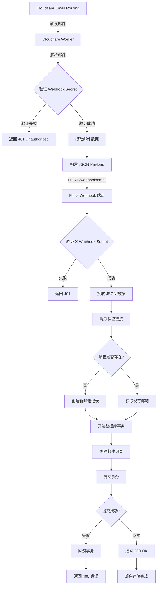

### 1.2 数据转换流程

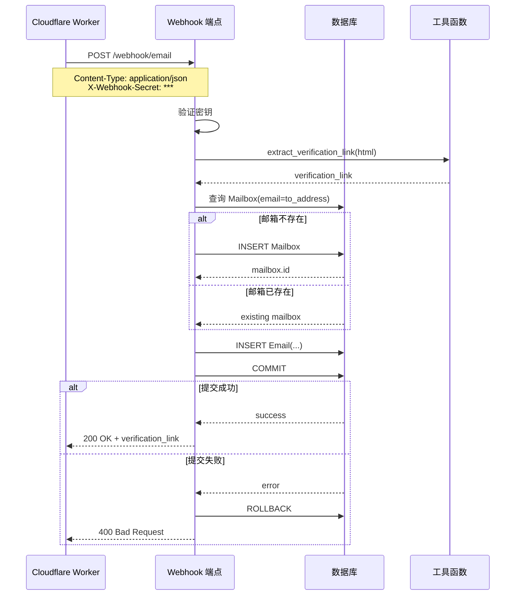

---

## 2. API 查询流程

### 2.1 获取验证链接流程

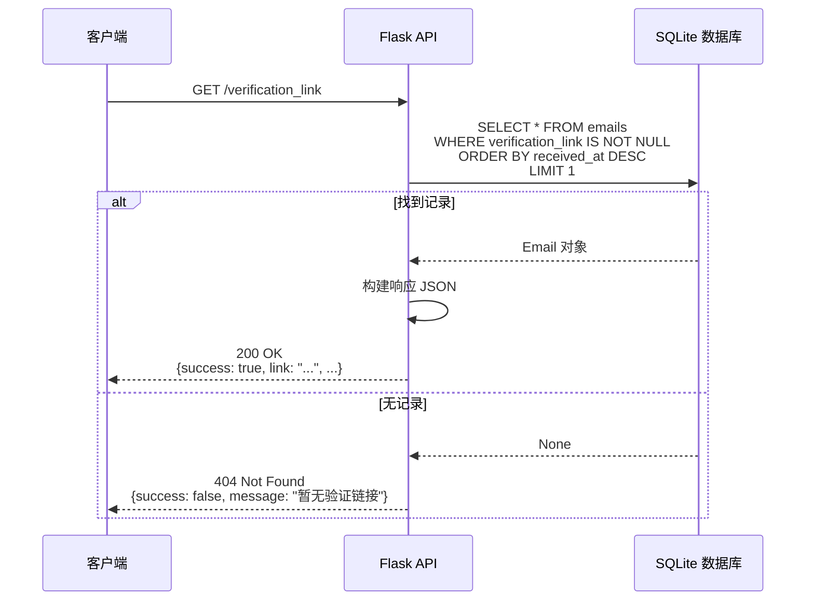

### 2.2 邮件搜索流程

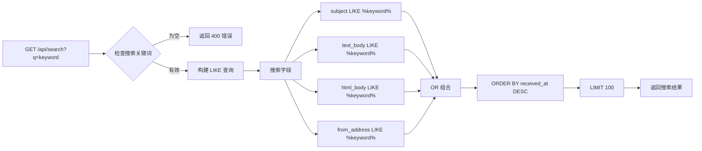

### 2.3 邮件详情查询时序图

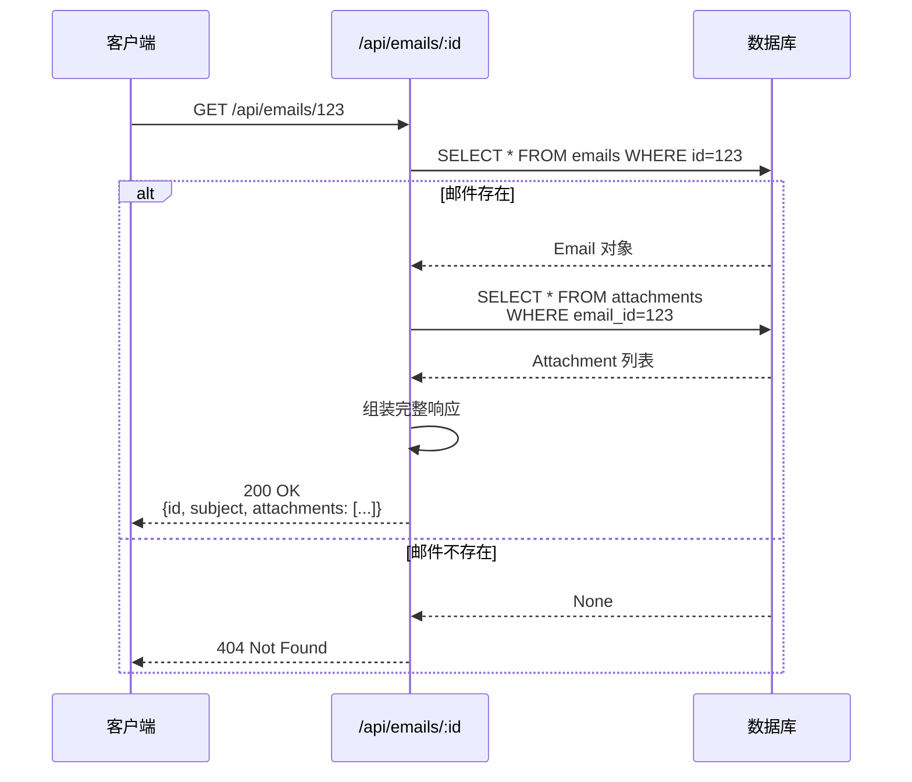

---

## 3. 验证链接提取流程

### 3.1 链接提取算法

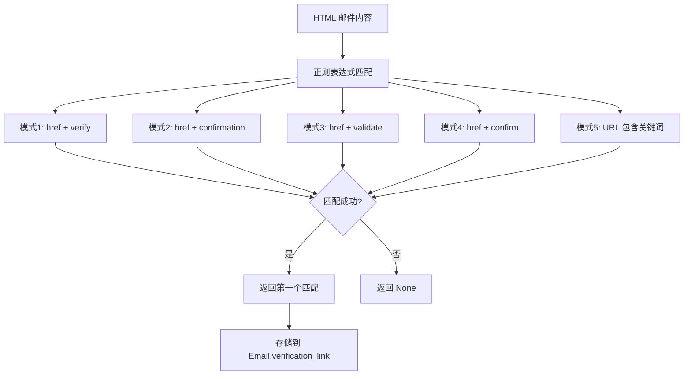

### 3.2 验证链接点击流程

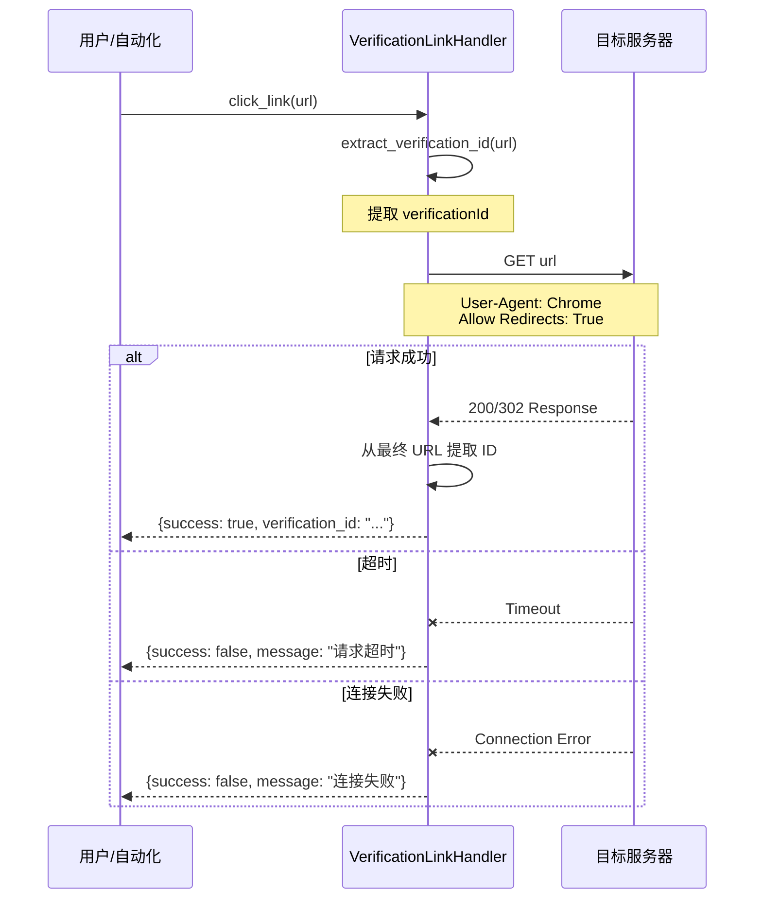

---

## 4. 数据库事务流程

### 4.1 邮件接收事务

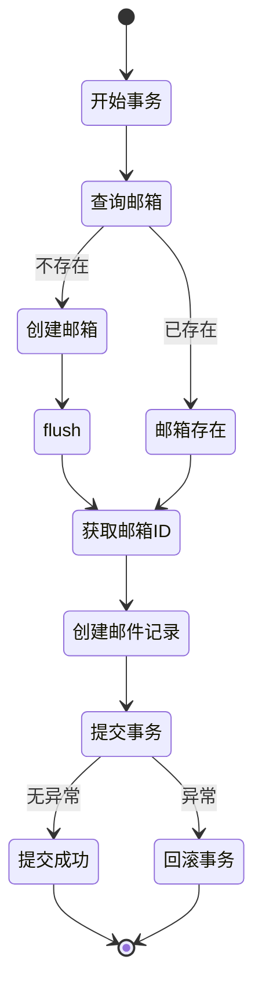

### 4.2 邮件删除事务

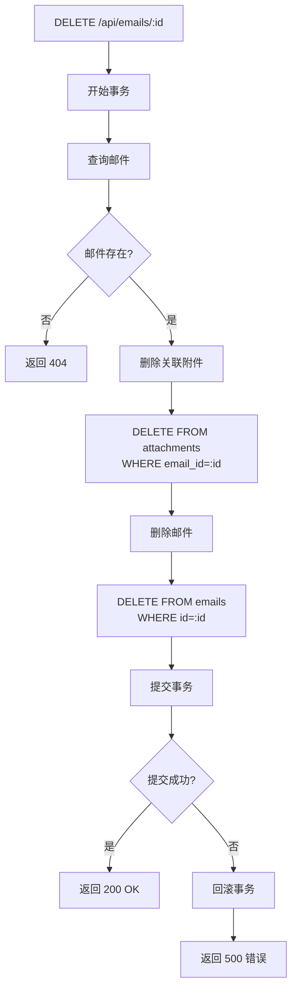

### 4.3 邮件更新事务

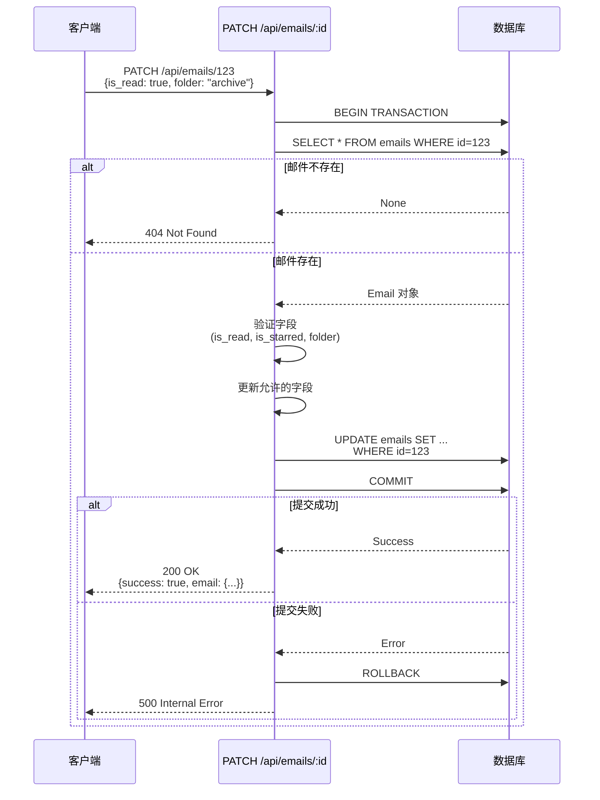

---

## 5. 错误处理流程

### 5.1 Webhook 错误处理

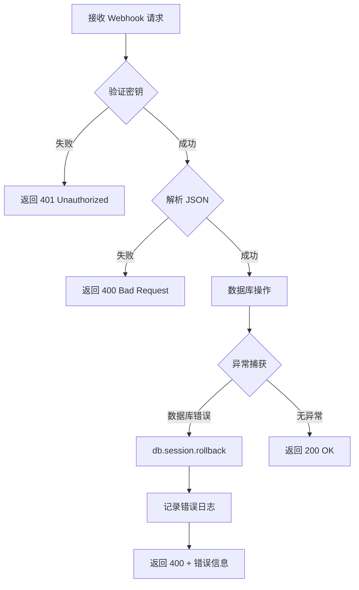

### 5.2 API 错误分类

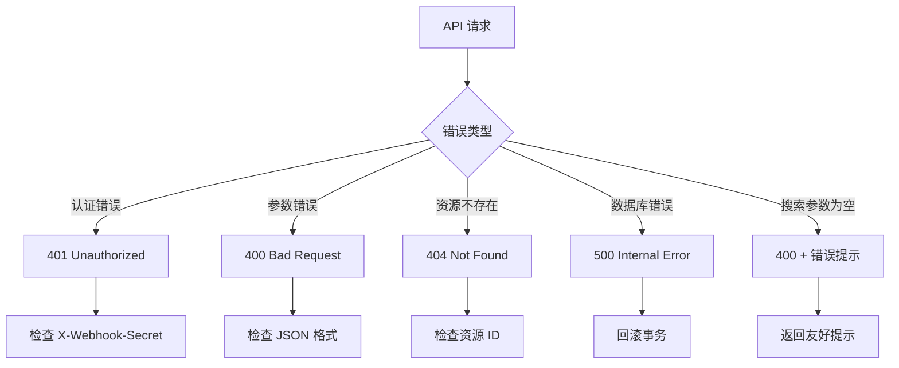

### 5.3 链接处理错误流程

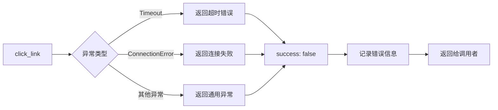

---

## 6. 邮件生命周期

### 6.1 完整生命周期图

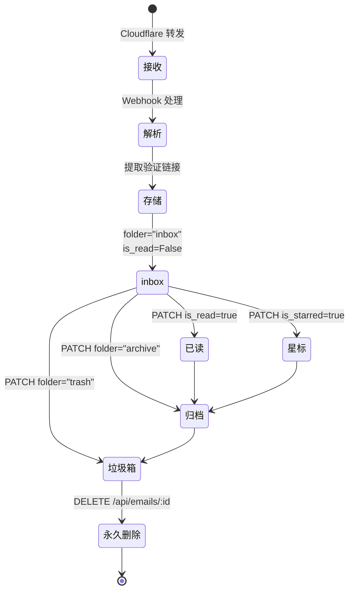

### 6.2 状态字段说明

| 字段 | 类型 | 默认值 | 说明 |
|------|------|--------|------|
| `is_read` | Boolean | `false` | 是否已读 |
| `is_starred` | Boolean | `false` | 是否星标 |
| `folder` | String | `"inbox"` | 所属文件夹 (inbox/archive/trash) |
| `received_at` | DateTime | `utcnow()` | 接收时间 |

### 6.3 数据操作时间线

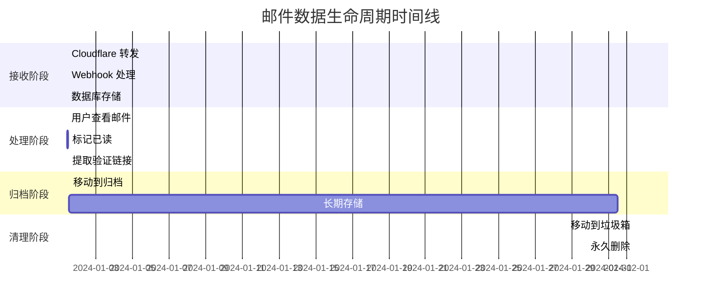

---

## 7. 关键数据流路径

### 7.1 Webhook 到数据库路径

```
Cloudflare Email Routing
    ↓
Cloudflare Worker (解析邮件)
    ↓
POST /webhook/email
    ↓
webhooks.receive_email()
    ↓
extract_verification_link(html)
    ↓
Mailbox 查询/创建
    ↓
Email 记录创建
    ↓
SQLite 数据库
```

### 7.2 查询到响应路径

```
客户端请求 GET /api/emails/:id
    ↓
routes.get_email_detail(id)
    ↓
db.session.query(Email)
    ↓
db.session.query(Attachment)
    ↓
JSON 序列化
    ↓
HTTP 响应返回
```

### 7.3 搜索流程路径

```
GET /api/search?q=keyword
    ↓
routes.search_emails()
    ↓
构建 LIKE 查询
    ↓
db.session.query(Email).filter(OR(...))
    ↓
ORDER BY received_at DESC
    ↓
LIMIT 100
    ↓
返回结果列表
```

---

## 8. 性能优化点

### 8.1 数据库索引

```sql
-- 邮箱查询索引
CREATE INDEX idx_emails_mailbox ON emails(mailbox_id);

-- 文件夹过滤索引
CREATE INDEX idx_emails_folder ON emails(folder);

-- 时间排序索引 (降序)
CREATE INDEX idx_emails_received ON emails(received_at DESC);
```

### 8.2 查询优化

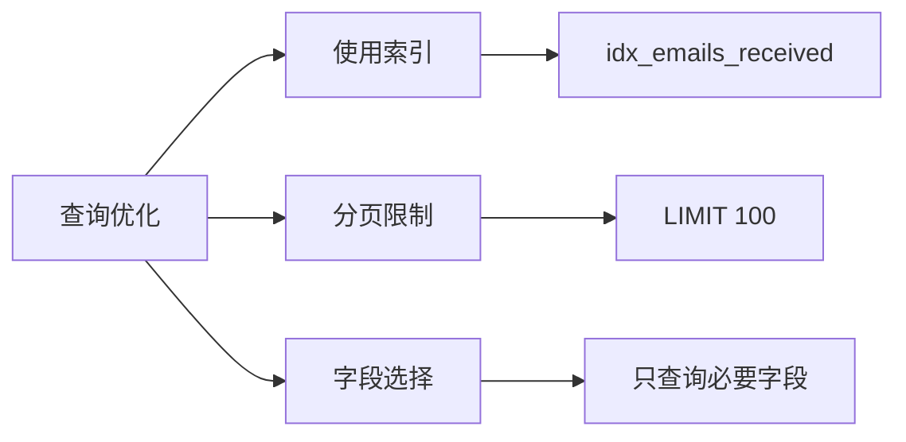

### 8.3 事务优化

- 使用 `db.session.flush()` 获取自增 ID 而不立即提交
- 批量操作使用单个事务
- 异常时自动回滚，避免数据不一致

---

## 9. 安全机制

### 9.1 认证流程

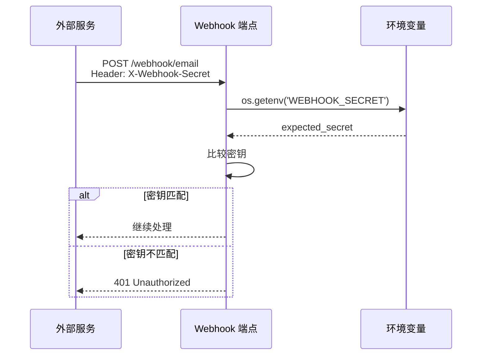

### 9.2 CORS 配置

```
允许的来源: os.getenv('CORS_ORIGINS')
默认值: http://localhost:3000
支持多域名: 逗号分隔
```

---

## 10. 监控与日志

### 10.1 关键监控指标

```mermaid
graph TB
    A[监控指标] --> B[邮件接收量]
    A --> C[验证链接提取成功率]
    A --> D[数据库查询性能]
    A --> E[错误率]

    B --> F[/status 端点]
    C --> F
    D --> G[慢查询日志]
    E --> H[异常捕获]
```

### 10.2 状态端点

```json
GET /status

{
  "status": "running",
  "emails_count": 1234,
  "links_count": 456,
  "timestamp": "2024-01-01T10:00:00"
}
```

---

## 总结

本文档涵盖了 EmailHandler 系统的所有关键数据流：

1. **接收流程**: Cloudflare → Webhook → 数据库
2. **查询流程**: API 端点 → 数据库查询 → JSON 响应
3. **验证链接**: 正则提取 → 存储 → HTTP 点击
4. **事务管理**: 开始 → 操作 → 提交/回滚
5. **错误处理**: 异常捕获 → 回滚 → 友好提示
6. **生命周期**: 接收 → 处理 → 归档 → 删除

所有流程都采用可视化 Mermaid 图表展示，便于理解和维护。
